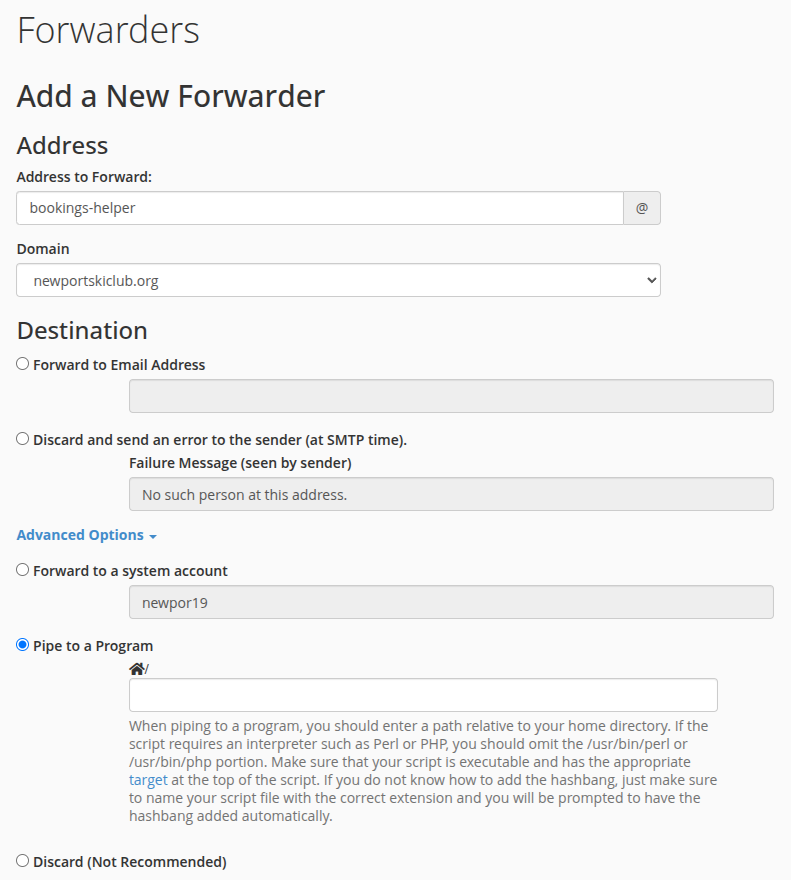

# nscmailbot

**Purpose:** **NORA** (Newport Ski Club Online Reservation Agent) sends **booking notification emails** whenever something changes—confirmations, cancellations, tentative holds, edits, and the like. Those messages arrive at the club’s **bookings** email address. This project **collects** each notice as **one line in a text log** on the server, then **sends a summary digest** of that log to the **reservationist** on a schedule you pick (for example daily). After the digest is sent, the old log is **archived** and logging starts fresh.

You do not need a database or extra PHP libraries—only what your web host already provides.

---

## How that works (simple version)

1. **Collect:** When a NORA notification arrives at the booking address, the host can **pipe** the message into a small script. The script reads the email and **adds one line** to a log file (by default under `~/logs/booking_activity.log` when mail is piped in). That line is a short summary: **event type, contact name, stay dates in US form, and headcounts**—easy to scan in a digest.

2. **Digest:** A **second script** runs on a **timer** (cron). If the log has anything in it, it **sends that text to the reservationist** as the body of one email—the digest—then **saves the old log** with a date in the filename and begins a fresh log.

3. **Other mail:** If someone writes a normal email to the booking address (not a NORA template), it still gets a line in the log, usually **just who it is from and the subject**, so it does not look like a booking row.

---

## What you need

- **PHP 7.4 or newer** on the server (PHP 8 is fine).
- Hosting where you can **upload files** and use **cPanel → Forwarders** with **Pipe to a Program** (this doc is written with **Bluehost** in mind).
- **SSH or File Manager** is enough to create a folder, set permissions, and optionally fix the first line of a script if your PHP lives in a non-standard path.

---

## Install (step by step)

### 1. Copy the project into your home directory

Upload this repository (or a zip of it) so it ends up as a folder named **`nscmailbot`** sitting **directly in your home directory**—not inside `public_html`. You should have paths like:

- `nscmailbot/bin/process_booking_email.php`
- `nscmailbot/bin/notify_reservationist.php`
- `nscmailbot/src/` (many `.php` files)

On the server, “home” is usually `/home/your_cpanel_username/`, so the full path is often `/home/your_cpanel_username/nscmailbot/`.

### 2. Create a folder for the log file

Create **`logs`** next to `nscmailbot` (still under your home directory), for example:

- `~/logs/` → `/home/your_cpanel_username/logs/`

The booking script will write **`booking_activity.log`** there when mail is piped in (see below). Make sure the account user that runs the pipe can create and write files in that folder.

### 3. Make the scripts executable

In SSH:

```bash
chmod +x ~/nscmailbot/bin/process_booking_email.php
chmod +x ~/nscmailbot/bin/notify_reservationist.php
```

Bluehost’s pipe option expects a **runnable script**, not “call php by hand” in the form.

### 4. Point the first line of the script at your PHP binary

Open **`nscmailbot/bin/process_booking_email.php`**. The **very first line** should look like:

```text
#!/usr/bin/php
```

If your host uses a different PHP (MultiPHP, EasyApache, etc.), change that line to match the path you get from SSH, for example:

```bash
which php
```

Sometimes it is under `/opt/cpanel/ea-php82/root/usr/bin/php` (the number may differ). Put that full path after the `#!` on line 1. Do the same for **`notify_reservationist.php`** if you plan to run it with `./notify_reservationist.php`; otherwise running it as `php notify_reservationist.php` from cron still works without relying on the shebang.

### 5. Hook up the email forwarder (pipe)

In cPanel, go to **Forwarders** and add a forwarder for your booking address (for example `bookings@yourdomain.org`). Choose the option to **pipe to a program** (wording may be “Pipe to a Program” or similar).

Bluehost asks for a path **relative to your home directory** and tells you **not** to type `php` or `/usr/bin/php` in the box—only the script path.

Enter:

```text
nscmailbot/bin/process_booking_email.php
```

If the form shows an example with a leading pipe character (`|`), follow **your** screen’s example.

**Screenshot:** The field and surrounding options should match your host’s forwarder screen. A reference capture is in the repo as **`doc/forwarder-screenshot.png`**:



After you save, send a test message to the booking address and confirm that **`~/logs/booking_activity.log`** gains a new line (or fix permissions / shebang if it does not).

### 6. (Optional but typical) Send the digest to the reservationist

This is the second half of the purpose: **turn the collected NORA lines into one summary email** for whoever handles reservations. Use **Cron Jobs** in cPanel to run the notifier once a day (or as often as you like). It reads the whole log, **emails that text to the reservationist**, then **archives** the log file with a timestamp in the same folder and creates a new empty log.

You must set environment variables the script expects. Example wrapper you could run from cron:

```bash
#!/bin/bash
export NSC_ACTIVITY_LOG=/home/your_cpanel_username/logs/booking_activity.log
export NSC_MAIL_TO=reservationist@example.org
export NSC_MAIL_FROM=bookings@newportskiclub.org
export NSC_MAIL_SUBJECT="Newport Ski Club booking activity"
cd /home/your_cpanel_username/nscmailbot
php bin/notify_reservationist.php
```

| Variable | Required? | Meaning |
|----------|-----------|---------|
| `NSC_ACTIVITY_LOG` | Yes | Full path to the same log file the pipe appends to |
| `NSC_MAIL_TO` | Yes | Who receives the digest |
| `NSC_MAIL_FROM` | No | Shown as the sender (default is `bookings@newportskiclub.org`) |
| `NSC_MAIL_SUBJECT` | No | Subject line for the digest email |

If the log is missing or empty, the script does nothing and exits successfully. If sending mail fails, it **does not** rename the log, so you can fix mail and run again.

**Note:** Delivery uses PHP’s built-in `mail()` function, which depends on your host. If messages never arrive, you may need hosting support or a future change to use SMTP.

---

## Trying it without email (optional)

From SSH, with the project as your current directory:

```bash
cd ~/nscmailbot
php bin/process_booking_email.php "sample-emails/Cancelled Booking from 3 6 2026 to 3 7 2026.eml"
```

That prints a short summary and the same style of line that would be appended when mail is piped. Add `--log ~/logs/booking_activity.log` if you want to append during a manual test.

---

## What ends up in the log

**Typical NORA notifications** get one line per email (no booking ID in the line; times are **US `M/d/y` with 12-hour clock**):

```text
2026-04-10T08:42:11Z | CANCELLED | Brian Sperlongano | 3/6/2026 11:30 AM -> 3/8/2026 11:00 AM | 1 member
```

Occupancy on that line is plain English (`1 member`, `2 guests`, …); **zero categories are omitted**. If no one was counted, the line ends after the dates (no `members=0`-style fields).

The same booking might also be summarized for people as: `CANCELLED: Brian Sperlongano, 3/6 (2 nights), 1 member`—**start date as `M/d` plus night count**.

**Mail from a real person to the bookings address** that is not a booking template is usually logged more simply:

```text
2026-04-10T08:42:11Z | UNKNOWN | from="Name" <email@example.com> | subject=Their subject line
```

The script recognizes common NORA email types: **confirmed** and **tentative** booking notices (both logged as **BOOKED**), **cancelled**, and short **“booking NP… was edited”** messages (**EDITED**). Anything else is **UNKNOWN**.

---

## Piped mail: what actually gets fed to the script

The host normally passes the **entire email** (headers and body). The code finds the readable body part and, when needed, who it is from and what it is about. You do not have to strip headers yourself.

---

## Tests (developers)

```bash
php tests/run_tests.php
```

Tests use saved samples under [`sample-emails/`](sample-emails/). If PHP is not on your machine:

```bash
docker run --rm -v "$PWD":/app -w /app php:8.2-cli php tests/run_tests.php
```

---

## Project layout (reference)

| Location | Role |
|----------|------|
| [`bin/process_booking_email.php`](bin/process_booking_email.php) | Entry point for the pipe and for manual runs |
| [`bin/notify_reservationist.php`](bin/notify_reservationist.php) | Cron job: email log, then roll log file |
| [`src/`](src/) | Parsing, formatting, MIME handling, log append |
| [`sample-emails/`](sample-emails/) | Example messages for tests |
| [`tests/run_tests.php`](tests/run_tests.php) | Self-contained checks (no Composer) |
| [`doc/forwarder-screenshot.png`](doc/forwarder-screenshot.png) | Reference screenshot for the cPanel forwarder / pipe field |
